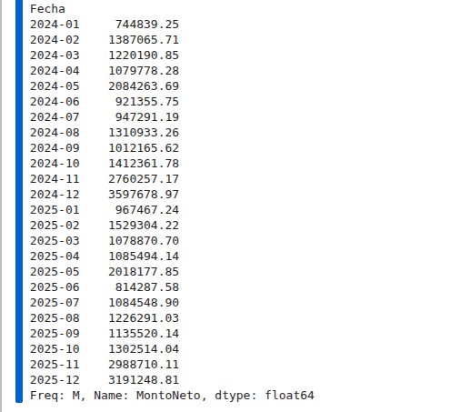
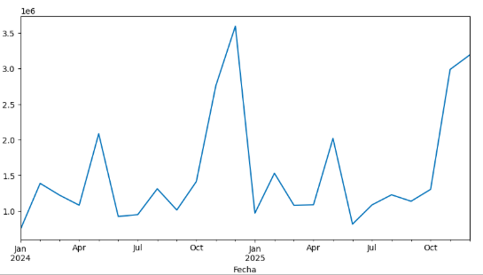
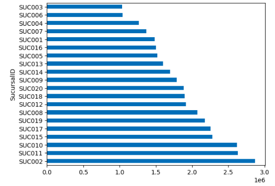
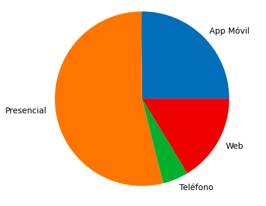
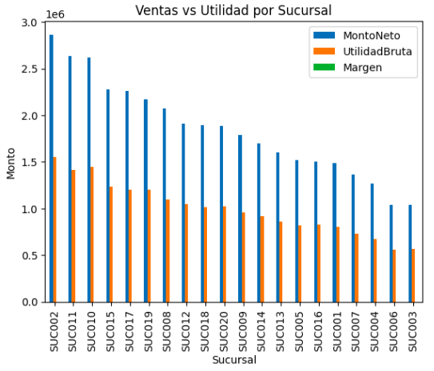

# Analisis de Ventas - Proyecto BI

## Objetivo
Analizar el comportamiento de ventas, utilidad y rendimiento por sucursal, canal y producto.

## Dataset

El dataset utilizado contiene información de ventas realizadas por distintas sucursales. Entre los datos disponibles se encuentran las fechas de venta, clientes, productos, sucursales, cantidades vendidas, descuentos, métodos de pago, canales de venta, montos de venta y utilidades.

## Herramientas que se usaron

- Python.
- Librería Pandas: Para analizar los datos.
- Librería Matplotlib: Para visualizar los datos.
- Jupyter Notebook.

## Analisis

Lo primero que se hizo fue cargar los datos.

```python
import pandas as pd
import matplotlib.pyplot as plt

df = pd.read_csv("FactVentas.csv")
```

Luego se revisó la tabla y las columnas para limpiar el dataset con los siguientes pasos:

- Conversión de fechas.
- Eliminación de nulos.
- Validación de tipos de datos.

Hecho esto, pasamos a llamar al dataframe como `df_filtered`, ya que se filtraron los primeros datos para trabajar únicamente con la información necesaria para el análisis.

## KPIs Principales

Una vez preparados los datos, se calcularon los primeros KPIs para tener una visión general del desempeño del negocio.

```python
ventas_totales = df_filtered["MontoNeto"].sum()
utilidad_total = df_filtered["UtilidadBruta"].sum()
margen_promedio = df_filtered["MargenBruto"].mean()

print(f"${ventas_totales:,.2f}")
print(f"${utilidad_total:,.2f}")
print(f"${margen_promedio:,.2f}")
```

Los KPIs obtenidos fueron:

- Ventas Totales: Cantidad total de dinero generado por las ventas.
- Utilidad Total: Cantidad total de ganancia obtenida.
- Margen Promedio: Porcentaje promedio de ganancia respecto a las ventas.

Estos indicadores permiten conocer rápidamente el estado general del negocio antes de realizar análisis más específicos.

## Analisis de Ventas por Mes

Después se realizó un agrupamiento de las ventas por mes utilizando la fecha de cada venta y el monto neto generado.

```python
ventas_mes = df_filtered.groupby(
    df_filtered["Fecha"].dt.to_period("M")
)["MontoNeto"].sum()

ventas_mes
```

Y nos dio el siguiente resultado:



Posteriormente se realizó una gráfica para visualizar mejor el comportamiento de las ventas.

```python
ventas_mes.plot(figsize=(10,5))
plt.show()
```



Con esta gráfica se puede observar el comportamiento de las ventas a lo largo del tiempo e identificar meses con mayor o menor actividad.

## Analisis por Sucursal y Canal

Después se realizaron dos gráficas más. Estas se hicieron para identificar qué sucursal generó más ventas y cuáles fueron los canales con mayor participación.

Para las sucursales:

```python
sucursalmasventas = df_filtered.groupby(
    "SucursalID"
)["MontoNeto"].sum().sort_values(ascending=False)

sucursalmasventas.plot(kind="barh")
plt.show()
```

Para los canales:

```python
canales = df_filtered.groupby(
    "Canal"
)["MontoNeto"].sum()

canales.plot(kind="pie")
plt.show()
```

Y estos fueron los resultados:





Estas gráficas permiten identificar qué sucursales generan más ingresos y cuáles son los canales de venta más utilizados por los clientes.

## Comparacion de Ventas vs Utilidad por Sucursal

Por último se comparó el monto neto generado por cada sucursal contra la utilidad bruta obtenida.

Esto se realizó debido a que una sucursal puede tener muchas ventas, pero eso no significa que sea la que genera mayor ganancia. Por esta razón se compararon ambas métricas.

```python
sucursal_analisis = df_filtered.groupby("SucursalID").agg({
    "MontoNeto":"sum",
    "UtilidadBruta":"sum"
})

sucursal_analisis = sucursal_analisis.sort_values(
    by="MontoNeto",
    ascending=False
)

sucursal_analisis
```

Se obtuvo una tabla donde aparecen las sucursales ordenadas de mayor a menor según su monto neto, junto con la utilidad bruta generada por cada una.

Posteriormente se realizó la siguiente gráfica:

```python
sucursal_analisis.plot(
    kind="bar"
)

plt.title("Ventas vs Utilidad por Sucursal")
plt.xlabel("Sucursal")
plt.ylabel("Monto")
plt.show()
```

Y se generó la siguiente gráfica:



Esta comparación permite identificar si las sucursales con mayores ventas también son las que generan mayores utilidades.

## Conclusiones

A través de este análisis se pudieron identificar las sucursales con mayores ventas, los canales de venta más utilizados y el comportamiento de las ventas a lo largo del tiempo.

También se observó que una sucursal con mayores ventas no necesariamente es la que genera mayor utilidad, por lo que es importante analizar ambas métricas antes de tomar decisiones.

El análisis permitió obtener una visión general del desempeño del negocio utilizando Python, Pandas y Matplotlib para transformar datos en información útil.

Este proyecto permitió aplicar conceptos de limpieza de datos, análisis exploratorio, cálculo de KPIs y visualización de información mediante gráficas.
